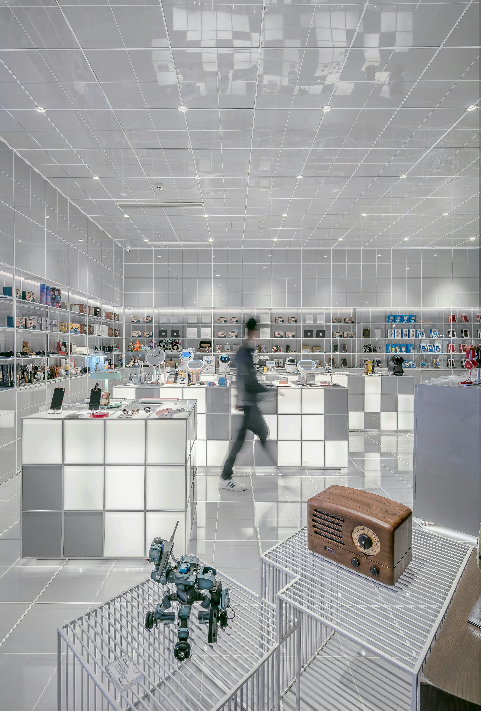

<!-- <!DOCTYPE html>  -->
<html lang="en">
<head>
    <meta charset="UTF-8">
    <meta name="viewport" content="width=device-width, initial-scale=1.0">
    <title>rueAlgo</title>
    
</head>
<body>

<header>
    
    <h1>Online Retail of Name Brand Products</h1>
</header>

<!-- Your website content -->

    
    
Our deep expertise in online retail and global market insight empower us to effectively manage and sell products, ensuring optimal pricing, strategic placement, and targeted consumer reach.

    
Trusted by brands across the spectrum, we uphold price and brand integrity, safeguard online reputations, and drive sales growth.

    
We work closely with supply chain partners, facilitating their journey towards success in the realm of online retail.

<!-- Map Section -->

    <!-- Left side: Google Maps embed -->
    <iframe src="https://www.google.com/maps/embed?pb=!1m14!1m8!1m3!1d2796.691951497211!2d-73.5549447!3d45.4961477!3m2!1i1024!2i768!4f13.1!3m3!1m2!1s0x4cc91af5718d4c33%3A0xf8210e1930cf408d!2s71%20Duke%20St%2C%20Montreal%2C%20QC%20H3C%200L6!5e0!3m2!1sen!2sca!4v1712811276486!5m2!1sen!2sca" frameborder="0" allowfullscreen="" loading="lazy" referrerpolicy="no-referrer-when-downgrade"></iframe>
    <!-- Right side: Text content -->
    

        Contact us <!-- Wrap "Contact us" in span element -->
        
9475-1898 Quebec Inc.

        
404-71 Duke St., Montreal, QC H3C 0L5

	
<a href="https://wa.me/16135018255">+1-613-501 8255</a>
 <!-- Add WhatsApp link to the phone number -->
	
<a href="mailto:ruealgo@mail.com">ruealgo@mail.com</a>
 

<!--    <form action="mailto:ruealgo@mail.com" method="post" enctype="text/plain">
        <input type="text" name="name" placeholder="Your Name">
        <input type="text" name="email" placeholder="Your Email">
        <textarea name="message" placeholder="Your Message"></textarea>
        <input type="submit" value="Send">
    </form>
-->
    

</body>
</html>
